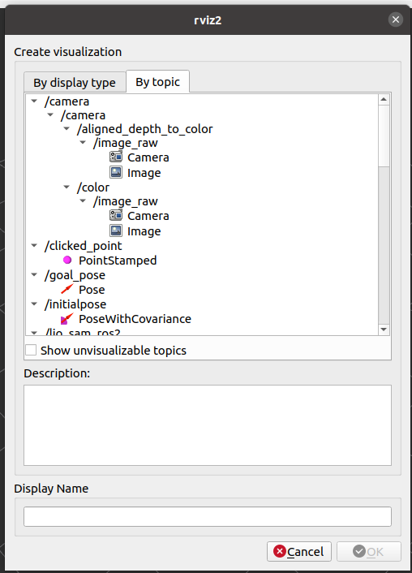
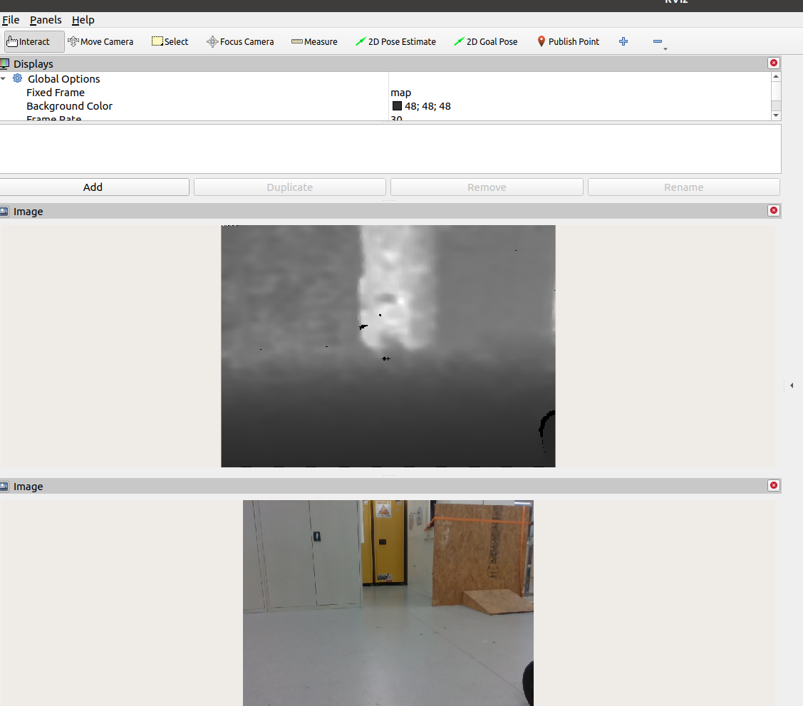

# 宇树 Go2 / Go2W / B2 — 边缘侧部署指南


英文文档: [点此查看](./Readme.md)

## 简介

本指南基于 InternNav (https://github.com/InternRobotics/InternNav) 项目，面向在宇树机器人（Unitree Go2 / Go2W / B2）上部署视觉感知与运动控制驱动的工程化落地。文档着重说明机器人端（edge）部署与调试步骤，服务器端部署请参见 InternNav 官方文档。

兼容性与适用范围：
- 目标平台：Unitree Go2（文档以板载算力盒为示例）及类似算力设备
- 推荐操作系统：Ubuntu 20.04 LTS（ROS 2 Foxy 官方支持）
- Python：3.8 及以上
- 相机：Intel RealSense 系列（推荐 D455）

致谢：本部署指南基于 InternNav 项目，并结合实际设备调试经验整理而成。

---

## 1. 硬件准备与配置

### 1.1 机器人基础配置

#### 1.1.1 固件升级
推荐将宇树机器狗固件升级至最新版本，以确保系统稳定性和兼容性。

#### 1.1.2 运动模式设置
为确保相机图像稳定性，请通过宇树官方手机 App 将机器狗的运动控制模式切换为 **AI 模式**。该模式下机器狗躯干姿态更加稳定，更适合执行视觉任务。

#### 1.1.3 通信接口配置
根据算力设备类型选择相应的连接方式：

- **板载算力盒**（机器人自带）：使用内部网络通信，无需额外硬件配置
- **外置算力设备**（如 Intel NUC、NVIDIA Jetson 等）：
  - 通过网线连接机器狗以太网接口
  - 默认网段：`192.168.123.x`
  - 详细配置方法请参考 [Unitree SDK2 官方文档](https://github.com/unitreerobotics/unitree_sdk2)

### 1.2 深度相机配置

#### 1.2.1 硬件选型
- **推荐型号**：Intel RealSense D455（配备全域快门，有效降低动态模糊）
- **兼容型号**：Intel RealSense D435/D435i

#### 1.2.2 机械安装
建议使用 3D 打印支架将相机架设于较高位置，以获取更优的前方地面视野范围。

**3D 打印模型下载**：[InternNav 3D 打印文件](https://github.com/InternRobotics/InternNav/tree/main/assets/3d_printing_files)

#### 1.2.3 线缆连接
- **数据线规格**：必须使用 **USB 3.2 Gen 1** 或更高规格的数据线
- **接口要求**：务必连接至算力盒 **前面板的 Type-C 接口**
- **注意事项**：使用不符合规格的线缆或错误的接口可能导致掉帧或设备无法识别

---

## 2. 软件环境配置

### 2.1 安装 Unitree SDK2 Python
本项目依赖宇树官方的 Python SDK。如果机载盒子未预装，请按以下步骤安装：

```bash
cd ~
sudo apt install python3-pip
git clone https://github.com/unitreerobotics/unitree_sdk2_python.git
cd unitree_sdk2_python
pip3 install -e .
```

### 2.2 安装 Intel RealSense 库

#### 2.2.1 安装 librealsense

安装 RealSense 官方库以支持深度相机功能。详细安装说明请参考 [官方文档](https://github.com/IntelRealSense/librealsense/blob/master/doc/installation_jetson.md)。

```bash
# 添加 RealSense 公钥
sudo apt-key adv --keyserver keyserver.ubuntu.com --recv-key F6E65AC044F831AC80A06380C8B3A55A6F3EFCDE || \
sudo apt-key adv --keyserver hkp://keyserver.ubuntu.com:80 --recv-key F6E65AC044F831AC80A06380C8B3A55A6F3EFCDE

# 添加软件源
sudo add-apt-repository "deb https://librealsense.intel.com/Debian/apt-repo $(lsb_release -cs) main" -u

# 安装库和工具
sudo apt-get install librealsense2-utils librealsense2-dev
```

#### 2.2.2 安装 Python 绑定

本项目通过 Python 调用相机并发布 ROS 2 话题，需要安装 RealSense Python 库：

```bash
pip3 install pyrealsense2
```

### 2.3 配置 InternNav 客户端环境

#### 2.3.1 克隆项目仓库

```bash
git clone https://github.com/InternRobotics/InternNav.git
cd InternNav
```

#### 2.3.2 安装 Python 依赖

**注意**：为避免 ROS 2 与 Conda 环境冲突，建议直接使用系统 Python 进行配置。

```bash
pip3 install numpy requests Pillow casadi
```

### 2.4 解决 CycloneDDS 依赖问题（如遇到）

若在安装 Unitree SDK2 时遇到以下错误：

```
Error when pip3 install -e .: Could not locate cyclonedds. Try to set CYCLONEDDS_HOME...
```

需要手动编译 CycloneDDS 并设置环境变量。

#### 2.4.1 编译 CycloneDDS

```bash
cd ~
git clone https://github.com/eclipse-cyclonedds/cyclonedds -b releases/0.10.x
cd cyclonedds
mkdir build install
cd build
cmake .. -DCMAKE_INSTALL_PREFIX=../install
cmake --build . --target install
```

#### 2.4.2 配置环境变量并重新安装 SDK

```bash
cd ~/unitree_sdk2_python

# 设置 CycloneDDS 路径（使用绝对路径）
export CYCLONEDDS_HOME="/home/unitree/cyclonedds/install"  # 根据实际用户名调整

# 重新安装 SDK
pip3 install -e .
```

**提示**：`~` 符号在某些情况下可能无法正确解析，建议使用完整的绝对路径。

---
## 3. 项目模块说明

本项目 `onboard` 文件夹包含机器人端核心模块，各模块功能如下：

| **模块名称**               | **功能描述**                                                 |
| -------------------------- | ------------------------------------------------------------ |
| **start_robot.sh**         | 一键启动脚本，负责按序启动驱动、ROS 2 桥接和相机节点，并提供进程守护功能。支持自定义网卡名称（默认：`eth0`） |
| **unitree_driver.py**      | 底层运动控制驱动，通过 UDP（端口 8899）接收运动指令并调用 Unitree SDK 控制机器人。支持遥控器高优先级直接控制 |
| **ros_bridge.py**          | ROS 2 消息桥接节点，订阅 `/cmd_vel_bridge` 话题并转发至驱动层，同时将机器人里程计信息发布至 `/odom_bridge` 话题 |
| **realsense_publisher.py** | 视觉感知节点，发布 640×480 @ 30fps 的 RGB 图像和深度图像。内置自动断线重连机制，有效应对线缆松动等异常情况 |

---

## 4. 系统启动与运行

### 4.1 授予执行权限

首次运行前，需为启动脚本赋予可执行权限：

```bash
cd onboard
chmod +x start_robot.sh
```

### 4.2 配置网络接口（可选）

脚本默认使用 `eth0` 网卡与机器人通信。若设备使用其他网络接口，请编辑 `start_robot.sh` 文件中的配置：

```bash
# ================= CONFIGURATION =================
# Set the network interface connected to the robot (default: eth0)
ROBOT_IF="eth0"  # 根据实际网卡名称修改，如 enp3s0、wlan0 等
# =================================================
```

### 4.3 启动所有节点

执行启动脚本，系统将自动按顺序启动所有必需的节点：

```bash
./start_robot.sh
```

### 4.4 验证系统状态

#### 4.4.1 查看运行日志

启动后，终端将输出如下日志信息。注意观察 **RealSense 自动重连机制**的演示（日志展示了相机断开后自动恢复的完整过程）：

```bash
unitree@ubuntu:$ ./start_robot.sh 
=========================================
   Launching OpenLegged Robot System
=========================================
   Target Interface: eth0
=========================================
[1/3] Starting Unitree Driver...
=== Starting Unitree Driver (UDP Mode) ===
[SDK] Initializing with interface: eth0
[Robot] Waking up robot...
[Robot] Robot is ready! Standing and balanced.
[Network] Listening for commands on UDP 127.0.0.1:8899
[2/3] Starting ROS Bridge...
[INFO] [1765254404.594853831] [unitree_ros_bridge]: ROS Bridge Started.
[INFO] [1765254404.595441097] [unitree_ros_bridge]:  -> Forwarding /cmd_vel_bridge to UDP 127.0.0.1:8899
[INFO] [1765254404.595892875] [unitree_ros_bridge]:  -> Relaying /utlidar/robot_odom to /odom_bridge
[3/3] Starting RealSense Publisher...
=========================================
   All Systems GO! Press Ctrl+C to stop.
=========================================
[INFO] [1765254405.799359588] [realsense_publisher]: RealSense publisher node initialized. Waiting for camera...
[INFO] [1765254405.810866674] [realsense_publisher]: Attempting to connect to RealSense camera...
[INFO] [1765254406.021692097] [realsense_publisher]: RealSense connected successfully: 640x480@30fps
[ERROR] [1765254415.312509196] [realsense_publisher]: Error during frame retrieval: Frame didn't arrive within 1000
[WARN] [1765254415.314037267] [realsense_publisher]: Resetting camera connection...
[WARN] [1765254415.552690704] [realsense_publisher]: RealSense disconnected/stopped.
[INFO] [1765254415.555379741] [realsense_publisher]: Attempting to connect to RealSense camera...
[INFO] [1765254422.355959001] [realsense_publisher]: RealSense connected successfully: 640x480@30fps
^C
=========================================
   Stopping all robot modules...
=========================================
```

#### 4.4.2 RViz2 可视化验证

在同一网络环境下的开发机上打开 RViz2，订阅以下 ROS 2 话题以验证系统正常运行：

| **话题名称**                                       | **数据类型** | **说明**           |
| -------------------------------------------------- | ------------ | ------------------ |
| `/camera/camera/color/image_raw`                   | sensor_msgs/Image | RGB 彩色图像       |
| `/camera/camera/aligned_depth_to_color/image_raw`  | sensor_msgs/Image | 对齐的深度图像     |
| `/odom_bridge`                                     | nav_msgs/Odometry | 机器人里程计信息   |

**可视化示例**：





---

## 5. 运行导航任务

### 5.1 配置服务器地址

编辑客户端配置文件，将推理服务器地址修改为实际 IP：

```bash
cd InternNav
nano scripts/realworld/http_internvla_client.py
```

找到以下行并修改 IP 地址：

```python
url='http://127.0.0.1:5801/eval_dual'  # 将 127.0.0.1 替换为推理服务器的实际 IP
```

### 5.2 启动推理服务器

在推理服务器上启动 HTTP 服务端。关于服务端的详细配置，请参考 [InternNav 官方文档](https://internrobotics.github.io/user_guide/internnav/)。

```bash
# 在推理服务器上执行
python3 scripts/realworld/http_internvla_server.py
```

### 5.3 启动机器人端

#### 终端 1：启动控制与感知节点

```bash
cd InternNav/onboard
./start_robot.sh
```

#### 终端 2：启动导航客户端

```bash
cd InternNav
python3 scripts/realworld/http_internvla_client.py
```

系统启动完成后，机器人将根据视觉感知和推理结果执行自主导航任务。

---

## 6. 常见问题排查

### 6.1 相机无法识别
- 检查 USB 线缆是否符合 USB 3.2 Gen 1 规格
- 确认连接至算力盒前面板的 Type-C 接口
- 运行 `rs-enumerate-devices` 命令检查设备连接状态

### 6.2 网络通信异常
- 使用 `ifconfig` 或 `ip addr` 确认网卡名称是否正确
- 检查与机器人的网络连通性：`ping 192.168.123.161`
- 确认防火墙未阻止 UDP 8899 端口

### 6.3 ROS 2 话题无数据
- 检查 ROS 2 环境变量：`echo $ROS_DOMAIN_ID`
- 确认开发机与机器人在同一 ROS_DOMAIN_ID
- 使用 `ros2 topic list` 验证话题是否正常发布

---

## 7. 参考资源

- [InternNav 官方文档](https://internrobotics.github.io/user_guide/internnav/)
- [InternNav GitHub 仓库](https://github.com/InternRobotics/InternNav/)
- [Unitree SDK2 文档](https://github.com/unitreerobotics/unitree_sdk2)
- [Intel RealSense 文档](https://github.com/IntelRealSense/librealsense)
